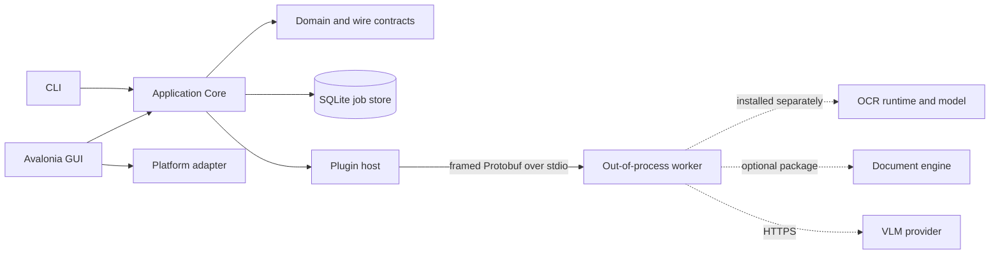

# System architecture

## Goals and boundaries

NEOCR is a local-first OCR desktop application and CLI. C# owns orchestration, persisted jobs, UI, hotkeys, platform integration, and export. Native OCR runtimes, document engines, and network providers run outside the host process.

The permissive host never bundles an AGPL document engine and never implements local VLM inference. VLM support consists of API-provider adapters plus independently versioned prompt recipes.

## Context map

## Dependency rule

`Contracts` has no project dependencies. `Core` depends only on `Contracts`. `Infrastructure`, `PluginHost`, and platform adapters depend inward on Core/Contracts. GUI and CLI are composition roots and may reference adapters. Workers depend on Contracts but never on GUI or Infrastructure.

Platform APIs are exposed to the application as ports owned by Core. macOS, Windows, and Linux adapters implement those ports without conditional platform code leaking into Core.

## Main flows

### Image and screenshot OCR

1. A composition root constructs a `JobSpec` containing file-backed image inputs, recognition options, and an export target.
2. `JobExecutionService` persists the queued job with its recognizer identity and claims it with a unique run ID and renewable lease.
3. The runner snapshots every input, skips valid succeeded/declined checkpoints, and asks an `IRecognizer` to process each pending page.
4. The plugin host reuses a healthy single-flight worker, sends a protocol-v1 request, and maps the correlated reply to succeeded, declined, or failed.
5. Each page outcome is committed before the next page and fenced by the current run ID. A pause request takes effect at that boundary.
6. The exporter atomically replaces the output file from ordered checkpoints, then the terminal state transition deletes the temporary page results in the same database transaction.

Interactive screenshots are intentionally ephemeral: the platform adapter returns PNG bytes, the GUI workflow writes a private temporary input, submits the normal job, reads the text result, and removes both temporary files. SQLite never stores pixels. It may temporarily store recognized text and geometry while a job is non-terminal, then removes them at a terminal transition.

### Documents

The target document flow is `document source -> ordered PageArtifact stream -> recognizer -> page checkpoints -> exporter`. PDF, XPS, EPUB, MOBI, FB2, and CBZ parsing belongs to separately installed document-source workers. A worker may decline a file without failing the job, allowing a policy-approved fallback.

## State and failure semantics

Jobs use explicit compare-and-swap transitions: queued, running, pausing, paused, completed, completed-with-errors, failed, or cancelled. Caller cancellation moves a running job to `cancelled` after the worker response stream is safe to reuse or the worker has been terminated. Batch pause finishes the active page, commits it, then moves `pausing` to `paused`; if the final page finished, completion and export win the race.

SQLite schema v3 records recognizer identity, ordered page snapshots, and the current run ID/lease expiry. Resume requires the same recognizer ID/version and unchanged file identity. Every running-state mutation is fenced by the run ID and a live lease. Explicit startup reconciliation moves only expired or pre-v3 lease-less `running`/`pausing` jobs to `paused`, preserving their checkpoints; a late former owner cannot write checkpoints or state. Completed, completed-with-errors, failed and cancelled transitions delete page-result JSON.

Recognizer cancellation is cooperative first: the worker acknowledges a separately correlated cancel request and emits a terminal response for the target request. The host drains both responses before reuse and terminates an unresponsive process after two seconds. Worker crashes and protocol faults fail the current task without an implicit retry; a later task starts a replacement process.

Plugin outcomes are deliberately distinct:

- **Succeeded** contains a spatial result and optional semantic Markdown.
- **Declined** means the plugin intentionally did not process the page and names allowed fallback classes.
- **Failed** means processing was attempted and produced an operational or model error.

Do not collapse decline into failure or silently select a fallback that violates privacy/local-only policy.

## Security, privacy, and trust

- Global shortcuts use OS registration APIs, never raw keyboard monitoring.
- Package manifests, protocol versions, RIDs, entry-point containment, and declared licenses are validated before process launch.
- A worker is isolated for reliability and dependency separation, not advertised as a security sandbox.
- Tokens and provider secrets must use a platform credential store when provider work begins; they must not enter job JSON, logs, or prompt recipes.
- Screenshot pixels are temporary by default. Batch inputs remain user-owned and are never deleted.

## Licensing

The host is Apache-2.0. First-party worker packages must publish their own runtime/model/license inventory. MuPDF or other copyleft document engines are distributed separately and are not linked into or downloaded by the host. Exported documents record the worker identity/version used to produce them when provenance support is implemented.
